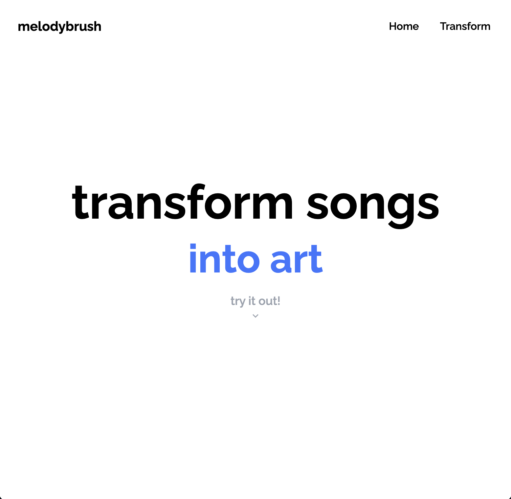
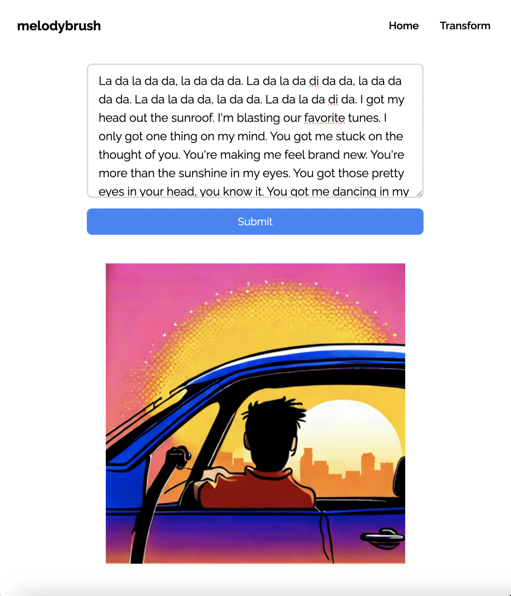
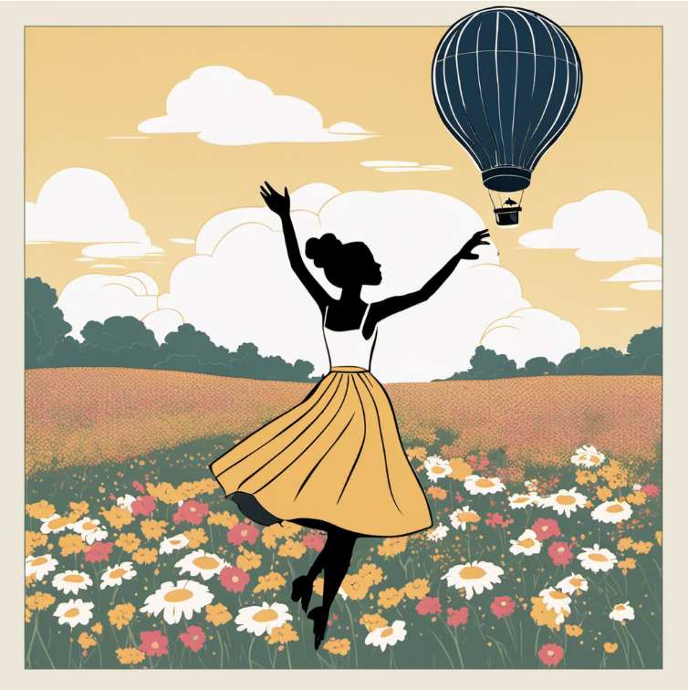
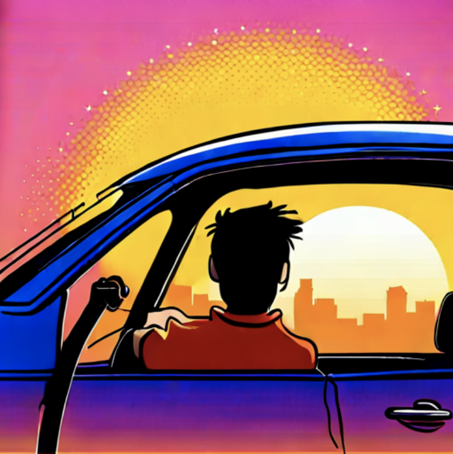
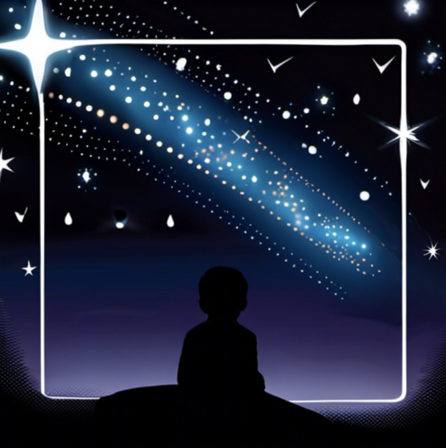
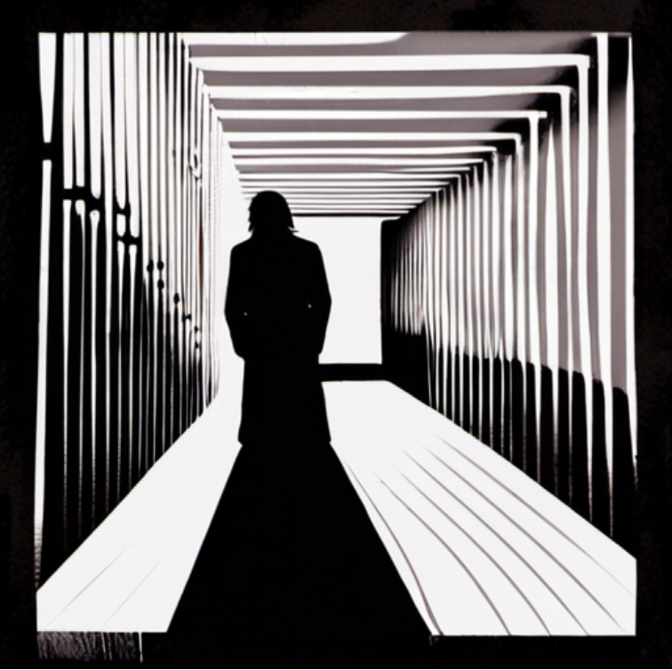

# melodybrush (UBC CIC Hackathon 2024) :musical_note:

melodybrush is a web application that facilitates transforms song lyrics into captivating artwork. The aim of this project was to 
1. allow music to be further accessible for those with hearing loss​

2. generate song covers

3. display stories and create narratives

4. create social media posts

​

    

## Project Inspiration :bulb:

Due to our love for music, we decided to create a more immersive experience for listeners through cloud computing and generative AI.

## Project Implementation :hammer_and_wrench:

    

melodybrush is composed of three major components:

1. Jurassic-2 Ultra (Amazon Bedrock Edition) by AI21 Labs
2. Stable Diffusion XL 1.0 by stability.ai
3. Web Application

### Jurassic-2 Ultra LLM :gear:

We utilized AI21's most power large language model to take lyrics and transform them into a short, descriptive prompt that can be easily drawn. We conducted hyperparameter tuning and prompt engineering through experimenting and testing with Amazon Bedrock's text playground and Jupyter Notebook. 

### Stable Diffusion XL 1.0 :gear:

The largest image generation model was used to take the response from Jurassic-2, and produce realistic and artistic pieces of artwork and resembles the song lyrics through various keywords, themes, and emotions. Hyperparameter tuning was conducted through Amazon Bedrock's image playground and Jupyter Notebook.

### Web Application :desktop_computer:

The web application was built using React JS paired with Tailwind CSS.

## Example Pieces :paintbrush:

| Song            | Artwork                                  |
|-----------------|------------------------------------------|
| Happy by Pharrell Williams |  |
| Falling by Harry Styles |  |
| Sunroof by Nicky Youre |  |
| Talking To The Moon by Bruno Mars |  |
| Twinkle Twinkle Little Star |  |
| Wake Me Up by Avicii |  |